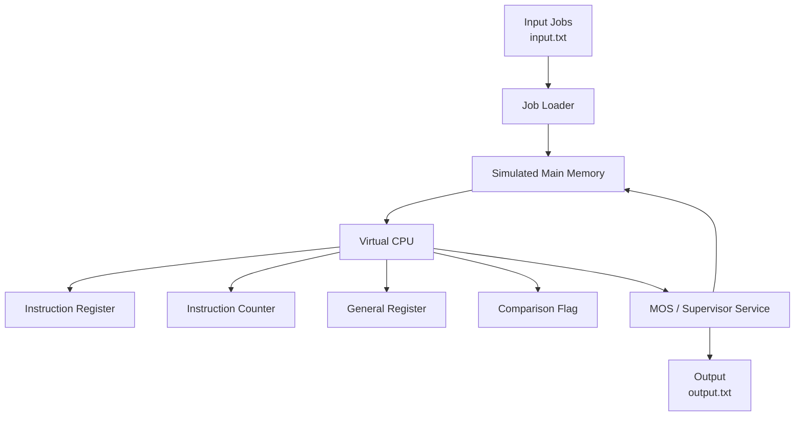
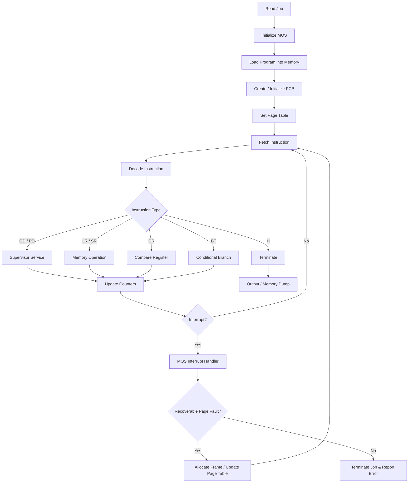

<div align="center">

# MULTIPROGRAMMING OPERATING SYSTEM

### **MOS Phase 1 & Phase 2 Implementation in C++**

[](https://isocpp.org/)
[]()
[]()

</div>

<br />

---

## 🧠 Overview

**Multiprogramming Operating System (MOS)** is a simulated operating-system environment developed as part of an Operating Systems laboratory project.

This repository implements **MOS Phase 1 and Phase 2 in C++**, progressively building a virtual machine capable of loading jobs, storing instructions in simulated memory, executing instructions, performing I/O operations, managing virtual memory through paging, handling interrupts and errors, and terminating jobs according to system constraints.

The implementation demonstrates how fundamental operating-system mechanisms interact at the machine level, including **memory management, instruction execution, supervisor calls, address translation, interrupts, page faults, and process/job control**.

Because apparently writing an OS from scratch wasn't enough suffering, the project does it with a simulated machine instead of letting the hardware take the blame.

---

# ⚙️ System Architecture



The system reads jobs from an input file, loads their program cards into simulated memory, executes instructions through the virtual CPU, and writes program output or termination information to an output file.

---

# 🧩 Phase 1

## Basic Machine & Instruction Execution

Phase 1 establishes the fundamental virtual machine required to execute MOS jobs.

The implementation uses:

* **100 memory locations**
* **4 characters per memory word**
* Instruction Register (`IR`)
* General Register (`R`)
* Instruction Counter (`IC`)
* Comparison Flag (`C`)
* Supervisor Interrupt (`SI`)
* Simulated input/output files

The implementation initializes memory and registers before processing each job.

### Supported Instructions

| Instruction | Operation                          |
| ----------- | ---------------------------------- |
| `GD`        | Get Data from input                |
| `PD`        | Print Data to output               |
| `LR`        | Load Register from memory          |
| `SR`        | Store Register into memory         |
| `CR`        | Compare Register with memory       |
| `BT`        | Branch on Toggle / comparison flag |
| `H`         | Halt execution                     |

The execution cycle fetches an instruction from memory, increments the instruction counter, identifies the opcode, and performs the corresponding operation.

### Supervisor Calls

Phase 1 implements supervisor services through the `SI` variable:

```text
SI = 1  →  GD  →  Read Data
SI = 2  →  PD  →  Write Data
SI = 3  →  H   →  Terminate Job
```

The `MOS()` routine handles these services and communicates with the input/output streams.

---

# 🧮 Phase 2

## Paging, Interrupts & Job Management

Phase 2 extends the basic machine into a significantly more complete MOS simulation.

The memory model is expanded to:

```text
300 memory locations
×
4 characters per word
```

The implementation introduces a **PCB (Process Control Block)** containing job-specific information such as:

* Job ID
* Total Time Limit (`TTL`)
* Total Line Limit (`TLL`)
* Total Time Counter (`TTC`)
* Line Limit Counter (`LLC`)
* Page Table Register (`PTR`)

---

## 🗂️ Paging & Address Translation

Phase 2 introduces virtual memory and paging.

A virtual address is divided into:

```text
Virtual Address
      │
      ├── Page Number
      │
      └── Offset
```

The implementation maps the virtual address to a physical address through the page table.

```text
VA
│
├── Page = VA / 10
└── Offset = VA % 10
        │
        ▼
     Page Table
        │
        ▼
     Frame Number
        │
        ▼
Physical Address
```

Invalid virtual addresses and invalid page-table entries generate appropriate program interrupts.

---

# 📄 Page Fault Handling

The Phase 2 implementation includes page-fault handling.

When an unmapped page is encountered, the system:

1. Identifies the required virtual page.
2. Allocates an available physical frame.
3. Updates the corresponding page-table entry.
4. Clears the program interrupt state.
5. Continues execution.

This is implemented through the `handlePageFault()` mechanism and frame allocation logic.

---

# 🚨 Interrupt & Error Handling

Phase 2 introduces program interrupts and system-level error reporting.

The implementation handles conditions including:

| Error                 | Description                             |
| --------------------- | --------------------------------------- |
| `OUT OF DATA`         | Program requests unavailable input data |
| `LINE LIMIT EXCEEDED` | Output exceeds permitted line count     |
| `TIME LIMIT EXCEEDED` | Execution exceeds allocated time        |
| `OPCODE ERROR`        | Invalid instruction opcode              |
| `OPERAND ERROR`       | Invalid instruction operand             |
| `INVALID PAGE FAULT`  | Invalid/unresolvable page fault         |

The system records diagnostic information including:

* Job ID
* Instruction Counter
* Instruction Register
* Time Used
* Lines Used

and produces a memory dump when a job terminates.

---

# 🔄 MOS Execution Flow



---

# 📊 Phase Comparison

| Feature                     | Phase 1 |  Phase 2 |
| --------------------------- | :-----: | :------: |
| Virtual CPU                 |    ✅    |     ✅    |
| Simulated Memory            |    ✅    |     ✅    |
| Instruction Execution       |    ✅    |     ✅    |
| `GD` / `PD`                 |    ✅    |     ✅    |
| `LR` / `SR`                 |    ✅    |     ✅    |
| `CR` / `BT`                 |    ✅    |     ✅    |
| Halt / Job Termination      |    ✅    |     ✅    |
| Paging                      |    ❌    |     ✅    |
| Page Table                  |    ❌    |     ✅    |
| Virtual Address Translation |    ❌    |     ✅    |
| Page Fault Handling         |    ❌    |     ✅    |
| PCB                         |    ❌    |     ✅    |
| Time Limit                  |    ❌    |     ✅    |
| Line Limit                  |    ❌    |     ✅    |
| Program Interrupts          |  Basic  | Advanced |
| Error Reporting             |  Basic  | Detailed |
| Memory Dump                 |    ✅    |     ✅    |

---

# 📝 Job Format

MOS jobs are supplied through `input.txt`.

A job follows the general structure:

```text
$AMJ
<PROGRAM CARDS>
$DTA
<DATA CARDS>
$END
```

### `$AMJ`

Marks the beginning of a job.

### Program Cards

Contain the instructions that are loaded into simulated memory.

Example:

```text
GD10
LR10
CR10
BT20
PD10
H
```

### `$DTA`

Marks the beginning of the data section used by `GD`.

### `$END`

Marks the end of the job.

---

# ▶️ Running Phase 1

Compile:

```bash
g++ Phase1.cpp -o phase1
```

Run:

```bash
./phase1
```

The program reads:

```text
input.txt
```

and generates:

```text
output.txt
```

---

# ▶️ Running Phase 2

Compile:

```bash
g++ Phase2.cpp -o phase2
```

Run:

```bash
./phase2
```

The execution processes the jobs from the configured input and generates corresponding output and termination information.

---

# 🧠 Concepts Demonstrated

This project provides hands-on implementation of:

* Virtual machine simulation
* CPU instruction cycle
* Instruction decoding
* Register operations
* Memory operations
* Supervisor calls
* Job loading
* Program execution
* Paging
* Page tables
* Virtual-to-physical address translation
* Dynamic frame allocation
* Page faults
* Program interrupts
* Time-limit handling
* Line-limit handling
* Error reporting
* Process Control Blocks
* Memory dumps
* File-based I/O

---

# 🛠️ Technologies

| Technology                     | Usage                            |
| ------------------------------ | -------------------------------- |
| **C++**                        | MOS implementation               |
| **File I/O**                   | Job input and output             |
| **Data Structures**            | PCB, page tables, frame tracking |
| **Operating Systems Concepts** | Memory, CPU, interrupts, jobs    |

Phase 2 uses standard C++ facilities including `iostream`, `fstream`, `vector`, `cstring`, and `ctime`.

---

# 🎯 Learning Objectives

The project demonstrates the progression from a basic machine simulator to a more complete multiprogramming operating-system model.

### Phase 1

> **Load → Fetch → Decode → Execute → I/O → Halt**

### Phase 2

> **Load → Page → Translate → Execute → Interrupt → Handle → Terminate**

The two phases therefore provide a practical progression from **instruction execution and supervisor calls** to **memory management, paging, interrupts, and controlled job execution**.

---

<div align="center">

<br />

• OS-MOS-SEM-II • AAYUSH RAHATE •

</div>
